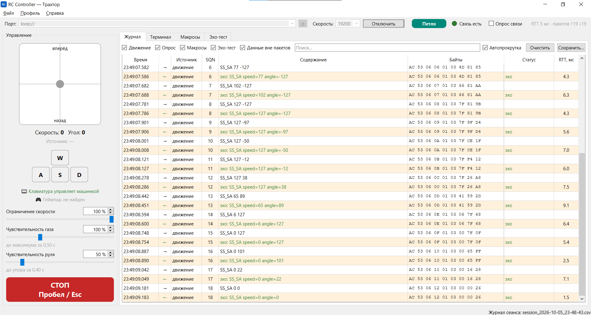

# RC Controller - пульт управления машинкой (КРЭА)

Программа для ноутбука, с которой управляют радиоуправляемой машинкой по UART: через **USB** или по **Bluetooth** (модуль HC-05). Проект курса «Конструирование РЭА».



## Возможности

- **Подключение по USB или Bluetooth** с индикатором, что используется сейчас. Bluetooth-порты HC-05 распознаются автоматически, отдельно помечен «входящий» порт Windows, через который подключиться нельзя.
- **Управление с клавиатуры** (WASD, работает и в русской раскладке) и **с геймпада** (Xbox-совместимый, XInput). Разгон плавный, есть ограничение скорости и аварийная остановка (Пробел / Esc / кнопка B).
- **Журнал команд**: каждый пакет и ответ в расшифрованном виде, время ответа, ошибки. Журнал сеанса автоматически сохраняется в CSV.
- **Терминал**: команды протокола по имени (`SS_SA 50 -20`), произвольный текст (AT-команды HC-05) и байты в HEX.
- **Макросы**: маршруты простым текстом - `вперёд 1.5`, `тормоз`, `назад 1.5`, повторы, любые команды.
- **Эхо-тест**: проверка, что машинка возвращает всё, что получила, с замером времени отклика.
- **Справка и FAQ** на русском (F1), включая список команд текущего профиля.
- **Всё, что зависит от прошивки**, вынесено в редактируемый файл профиля: команды, коды, параметры, формат пакета, CRC, клавиши. Код менять не нужно.

## Запуск

**Готовый exe.** Каждый push в репозиторий собирает `RC_Controller.exe` на GitHub Actions (вкладка **Actions** → последний запуск → **Artifacts** → `RC_Controller`). Установка не нужна. При первом запуске рядом с exe появятся папки `profiles`, `macros` и `logs`.

**Из исходников** (Windows, Python 3.11+):

```bat
run.bat
```

или вручную:

```bat
py -3 -m venv .venv
.venv\Scripts\pip install -r requirements.txt
.venv\Scripts\python -m rc_controller
```

**Собрать exe самостоятельно:** `build_exe.bat` - прогонит тесты и положит результат в `dist\RC_Controller.exe`.

**Без машинки:** введите в поле порта `loop://` - это виртуальная петля, всё отправленное возвращается обратно.

## Протокол и прошивка

Протокол - «Протокол информационно-логического взаимодействия» v1.0:

```
AC 53 | LEN | SQN | ADDR | CODE PARAM… | CRC
```

- UART 19200 бод, 8N1.
- **CRC-8/MAXIM-DOW**: полином 0x31, init 0x00, с отражением, контроль 0xA1. Эталонная реализация на C с самопроверкой - [`docs/protocol/crc8.c`](docs/protocol/crc8.c).
- Примеры пакетов (SQN = 0): `GET_TEL` → `AC 53 04 00 01 04 AB`, `SS_SA 50 -20` → `AC 53 06 00 01 03 32 EC 2F`.

Полное описание протокола - [`docs/protocol/PROTOCOL_NOTES.md`](docs/protocol/PROTOCOL_NOTES.md).

## Как поменять команды

Набор команд задаётся не в коде, а в профиле `rc_controller/resources/profiles/default.toml` (у exe - `profiles\default.toml` рядом с программой):

```toml
[[command]]
name = "SS_SA"
code = 0x03
params = [
    { name = "speed", type = "int8", min = -127, max = 127 },
    { name = "angle", type = "int8", min = -127, max = 127 },
]
description = "Скорость и угол одной командой"
```

После правки нажмите **Ctrl+R** в программе. Если в файле ошибка, программа покажет, в какой строке. Подробно - в справке программы, раздел «Профиль».

## Для разработчиков

| Путь | Что там |
|---|---|
| `rc_controller/protocol/` | CRC, пакеты, профиль, команды - без Qt, покрыто тестами |
| `rc_controller/control/` | математика движения и язык макросов - без Qt |
| `rc_controller/runtime/` | порт (pyserial), обмен запрос-ответ, цикл движения, макросы, геймпад, эхо-тест |
| `rc_controller/gui/` | окна и панели PyQt6 |
| `rc_controller/resources/` | профиль, примеры макросов, справка |
| `tests/` | pytest + pytest-qt |
| `packaging/` | сборка exe (PyInstaller) |
| `android/` | [имитатор машинки для Android](android/README.md): проверка программы по Bluetooth без железа |
| `docs/` | протокол, даташиты HC-05, [архитектура](docs/ARCHITECTURE.md) |

Тесты:

```bat
pip install -r requirements-dev.txt
set QT_QPA_PLATFORM=offscreen
python -m pytest
```

## Документация

- [`docs/protocol/`](docs/protocol) - протокол v1.0 и его описание, эталон CRC на C
- [`docs/datasheets/`](docs/datasheets) - HC-05: AT-команды и даташиты
- [`docs/ARCHITECTURE.md`](docs/ARCHITECTURE.md) - как устроена программа и как её расширять
